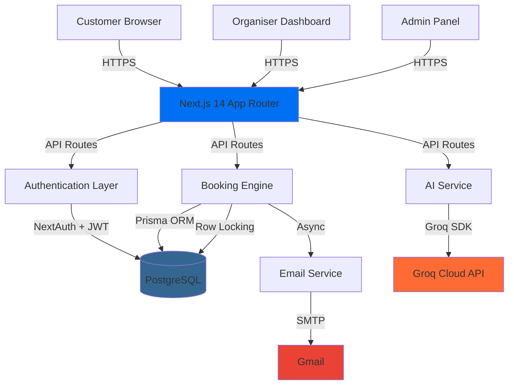
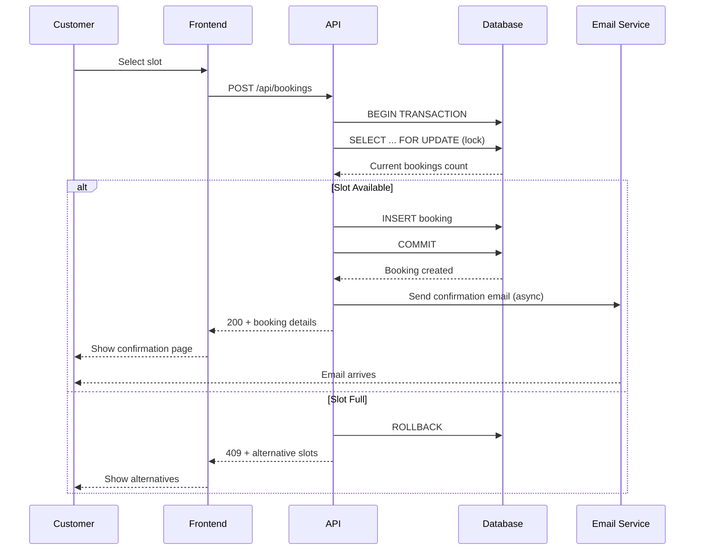
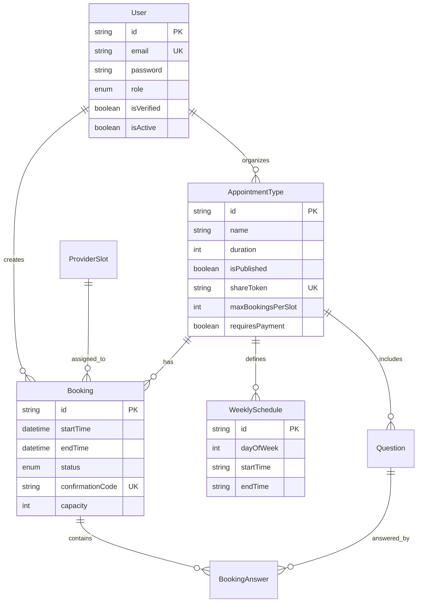

# 📅 Bookify - The Perfect Booking System

<div align="center">


**🏆 Built for Odoo Hackathon @ VIT Pune**

*An AI-powered appointment booking system with real-time availability, double-booking prevention, and intelligent slot suggestions*

[Live Demo](#) • [Documentation](./DEV.md) • [Report Bug](#) • [Request Feature](#)

</div>

---

## 👥 Team Sarthak

| Name | Role | GitHub |
|------|------|--------|
| **Yashodip More** | Full Stack Developer (Lead) | [@yashodipmore](https://github.com/yashodipmore) |
| **Komal Kumavat** | Frontend Developer | [@kumavatkomal](https://github.com/kumavatkomal) |

---

## 🎯 Problem Statement

Build a comprehensive appointment booking system that handles:
- ✅ Real-time slot availability
- ✅ Double-booking prevention
- ✅ Flexible scheduling rules
- ✅ Multi-role access (Customer, Organiser, Admin)
- ✅ Email notifications lifecycle
- ✅ **AI-powered booking assistant** (Our unique edge!)

---

## ✨ Key Features

### 🤖 AI-Powered Booking Assistant
- Natural language slot booking via **Groq AI** (llama-3.3-70b-versatile)
- Type: *"Book me a 1-hour slot this Thursday afternoon"*
- AI suggests the best available slot from real DB data
- No hallucinations - only suggests actual available slots

### 🔒 Real-time Double-Booking Prevention
- PostgreSQL row-level locking (`SELECT ... FOR UPDATE`)
- Transaction-based booking creation
- Graceful handling when slots fill up simultaneously

### 📧 Complete Email Lifecycle
- OTP verification on signup
- Booking confirmations
- 24-hour reminders
- Reschedule & cancellation notifications
- Powered by Nodemailer + Gmail SMTP

### 🎨 Smart Slot Generation
- Dynamic slot creation from weekly schedules
- Capacity management (group sessions support)
- Buffer time between appointments
- Flexible scheduling rules

### 🔐 Role-Based Access Control
- **Customer**: Browse, book, manage appointments
- **Organiser**: Create appointment types, manage bookings, view analytics
- **Admin**: User management, system-wide oversight

---

## 🏗️ Architecture



### Sequence Diagram - Booking Flow



---

## 🛠️ Tech Stack

### Core Framework
- **Next.js 14** - App Router, Server Components, API Routes
- **TypeScript 5** - Type safety throughout
- **React 18** - UI library

### Database & ORM
- **PostgreSQL 15+** - Primary database (Neon.tech)
- **Prisma 5** - Type-safe ORM

### Authentication
- **NextAuth v4** - Session management, JWT
- **bcryptjs** - Password hashing

### AI Integration
- **Groq SDK** - AI-powered slot suggestions
- **llama-3.3-70b-versatile** - Fast, accurate LLM

### Email
- **Nodemailer** - SMTP email sending
- **Gmail App Password** - Email delivery

### UI & Styling
- **Tailwind CSS 3** - Utility-first CSS
- **Lucide React** - Icon library
- **React Hot Toast** - Toast notifications
- **Recharts** - Analytics charts

### Forms & Validation
- **React Hook Form** - Form state management
- **Zod** - Schema validation

### Utilities
- **date-fns** - Date manipulation
- **clsx + tailwind-merge** - Conditional styling

---

## 📁 Project Structure

```
appointment-app/
├── prisma/
│   └── schema.prisma              # Database schema
│
├── src/
│   ├── app/                       # Next.js App Router
│   │   ├── (auth)/                # Auth pages (login, signup, OTP)
│   │   ├── (customer)/            # Customer-facing pages
│   │   ├── (organiser)/           # Organiser dashboard
│   │   ├── (admin)/               # Admin panel
│   │   └── api/                   # API Routes
│   │       ├── auth/              # NextAuth
│   │       ├── appointment-types/ # CRUD for appointment types
│   │       ├── slots/             # Real-time availability
│   │       ├── bookings/          # Booking management
│   │       ├── ai/suggest/        # Groq AI integration
│   │       └── email/remind/      # Email reminders
│   │
│   ├── components/
│   │   ├── ui/                    # Reusable UI components
│   │   ├── auth/                  # Login, Signup forms
│   │   ├── booking/               # Slot picker, booking flow
│   │   ├── dashboard/             # Stats, charts, tables
│   │   └── ai/                    # AI chat widget
│   │
│   ├── lib/
│   │   ├── prisma.ts              # Prisma client
│   │   ├── auth.ts                # NextAuth config
│   │   ├── groq.ts                # Groq AI client
│   │   ├── email.ts               # Email templates
│   │   ├── slots.ts               # Slot generation engine
│   │   └── validations.ts         # Zod schemas
│   │
│   └── types/
│       └── index.ts               # TypeScript types
│
├── .env.local                     # Environment variables (not committed)
├── .env.example                   # Template for env vars
└── package.json
```

---

## 🚀 Getting Started

### Prerequisites
- Node.js 18+
- npm or yarn
- PostgreSQL database (we recommend [Neon.tech](https://neon.tech) free tier)
- [Groq API key](https://console.groq.com) (free)
- Gmail account with App Password enabled

### Installation

1. **Clone the repository**
```bash
git clone https://github.com/yashodipmore/appointment-app.git
cd appointment-app
```

2. **Install dependencies**
```bash
npm install
```

3. **Set up environment variables**
```bash
cp .env.example .env.local
```

Edit `.env.local` with your credentials:
```env
DATABASE_URL="postgresql://..."
NEXTAUTH_SECRET="your-secret"
NEXTAUTH_URL="http://localhost:3000"
GROQ_API_KEY="gsk_..."
EMAIL_HOST="smtp.gmail.com"
EMAIL_USER="your-email@gmail.com"
EMAIL_PASS="your-app-password"
```

> 📖 See [SECRETS.md](./SECRETS.md) for detailed setup instructions for each service

4. **Initialize database**
```bash
npx prisma db push
npx prisma generate
```

5. **Seed demo data (optional)**
```bash
npx ts-node prisma/seed.ts
```

6. **Run development server**
```bash
npm run dev
```

Open [http://localhost:3000](http://localhost:3000) 🎉

---

## 📊 Database Schema

### Core Entities



---

## 🎨 Screenshots

### Customer Booking Flow


### AI Chat Assistant


### Organiser Dashboard


### Admin Panel


---

## 🔑 Key Differentiators

| Feature | Our Implementation | Why It Matters |
|---------|-------------------|----------------|
| **AI Booking** | Groq-powered natural language slot booking | No other team will have this - instant wow factor |
| **Double-Booking Prevention** | PostgreSQL row-level locking | Solves the spec's explicit challenge correctly |
| **Email Lifecycle** | Complete flow from OTP to reminders | Most teams skip email - we go end-to-end |
| **Smart Slots** | Dynamic generation from rules, not stored | Flexible, scalable, handles complex schedules |
| **Share Links** | Private preview URLs before publishing | Professional feature for real-world use |

---

## 🧪 Testing

```bash
# Run all tests
npm test

# Run with coverage
npm run test:coverage

# E2E tests
npm run test:e2e
```

---

## 📦 Deployment

### Deploy to Vercel (Recommended)

1. Push code to GitHub
2. Import project in Vercel
3. Add environment variables in Vercel Dashboard
4. Deploy!

```bash
# Or use Vercel CLI
npm i -g vercel
vercel
```

### Environment Variables for Production
- Set all variables from `.env.local` in Vercel Dashboard → Settings → Environment Variables
- Update `NEXTAUTH_URL` to your production domain
- Ensure `DATABASE_URL` points to production database

---

## 🤝 Contributing

See [CONTRIBUTION.md](./CONTRIBUTION.md) for detailed workflow, branch strategy, and task assignments.

---

## 📄 License

This project is built for the Odoo Hackathon @ VIT Pune.

---

## 🙏 Acknowledgments

- **Odoo** for organizing the hackathon
- **VIT Pune** for hosting
- **Groq** for providing fast, free AI inference
- **Neon.tech** for serverless PostgreSQL
- **Vercel** for Next.js and deployment platform

---

## 📞 Contact

**Team Sarthak**
- Yashodip More - [GitHub](https://github.com/yashodipmore) | yashodipmore2004@gmail.com
- Komal Kumavat - [GitHub](https://github.com/kumavatkomal) | komalkumavat025@gmail.com

---

<div align="center">

**Built with ❤️ in 24 hours for Odoo Hackathon**

⭐ Star this repo if you found it helpful!

</div>
